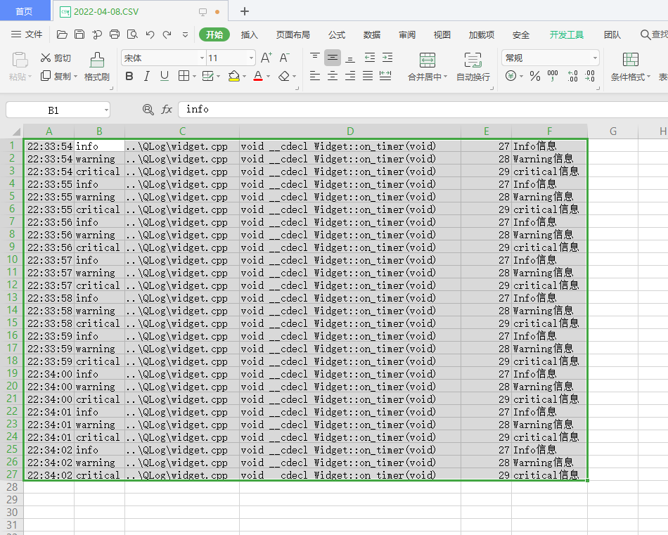
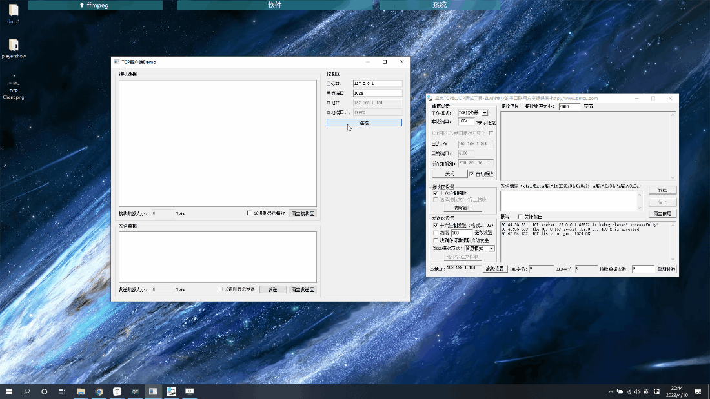
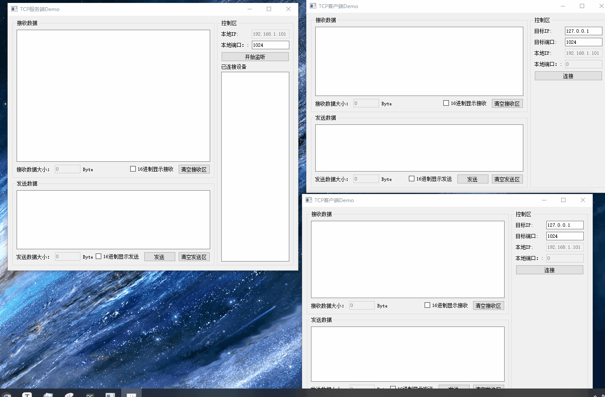
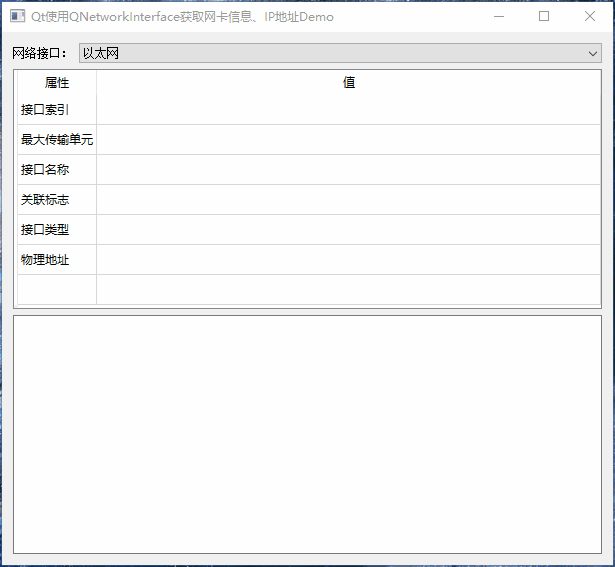
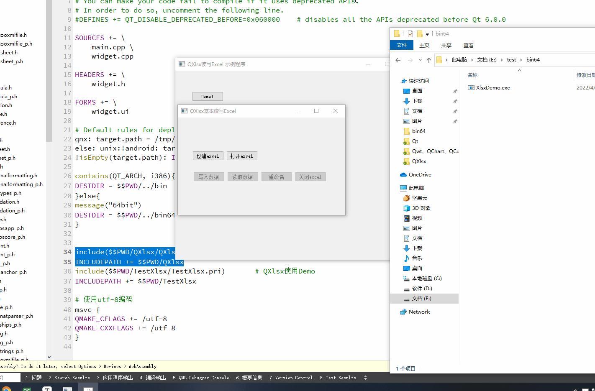

# QMDemo
Qt常用功能Demo

---

[toc]

---

# 一、个人主页

* [CSDN](https://blog.csdn.net/qq_43627907?type=blog)

# 二、说明

| 模块名           | 功能                                                         | 支持系统 |
| ---------------- | ------------------------------------------------------------ | -------- |
| QMWidget         | 基于QWidget实现的自定义窗口模块                              | windows  |
| DeviceManagement | 串口、鼠标、键盘热插拔监测功能模块                           | windows  |
| QLog             | Qt日志系统                                                   | 全平台   |
| QMPlayer         | 视频播放器界面                                               | windows  |
| TestCrashHandler | windows下程序崩溃定位Demo                                    | windows  |
| QMNetwork        | Qt网络编程Demo                                               | 全平台   |
| XlsxDemo         | Qt使用QXlsx读写Excel                                         | 全平台   |
| QtChartsDemo     | [Qt使用QtCharts模块绘制图表Demo](./QtChartsDemo/QtCharts.md) | 全平台   |

# 三、模块示例

## 1、 QMWidget

* **实现功能**

  * 鼠标在标题栏移动窗口
  * 双击标题栏最大化、还原
  * 窗口移动到屏幕边界实现1/4屏、1/2屏、全屏显示
  * 最大化、最小化、退出按键
  * 鼠标在窗口边缘，四角拉伸缩放窗口
  * 任务栏标题名称设置
  * 独立标题栏模块，便于后续扩展

* **演示**

  

## 2、 DeviceManagement

* **实现功能**

  * 通过继承**QAbstractNativeEventFilter**接口实现串口热插拔监测功能；
  * 通过在QWidget中重写**nativeEvent**实现串口热插拔监测功能；
  * 通过一个函数获取系统中所有可用串口名；
  * 自动添加、移除可用串口；
  * 鼠标、键盘热插拔监测。

* **演示**

  

  

## 3、 QLog

* **实现功能**

  * 可选择日志显示到文本窗口并保存、不显示只保存两种使用方式；
  * 选择显示日志级别；
  * 可设置不同级别日志显示颜色；
  * 支持将日志信息保存到纯文本Log文件中；
  * 支持将日志信息保存到纯文本CSV文件中，便于阅读、查找和分类日志信息，可用于将CSV中的日志信息导入数据库；
  * 支持按12小时、24小时、按文件大小、日志行数创建新日志文件；
  * 无任何第三方依赖，支持任意编译器，任意系统；
  * 保留日志存储接口、日志显示接口，便于后续扩展日志存储、显示方式，如存储到数据库等；
  * 模块完全基于QDebug，与程序所有功能基本0耦合，非常便于程序开发。

* **演示**

  

## 4、 QMPlayer

Qt实现的视频播放器界面Demo。

* **实现功能**
  * 基于QMWidget的自定义窗口；
  * 增加侧边栏模块；
  * 增加播放控制栏模块，包含播放停止、上一集、下一集、视频时间、音量控制、设置功能按键样式；
  * 增加进度条模块，可跳转到鼠标点击位置；
  * 通过`QPropertyAnimation`实现侧边栏、进度条、控制栏打开关闭动画效果；
  * 实现双击全屏显示、还原效果。
* **演示**

## 5、 TestCrashHandler

**实现功能：**

* 通过win api实现qt程序崩溃问题定位功能；
* 只支持**msvc编译器**；
* 低耦合模块，**一行代码**直接引用功能，无需添加第三方依赖库；
* 根据时间生成dump文件，每次崩溃生成一个文件，避免了覆盖问题；
* 程序崩溃时自动生成dmp文件，可通过WinDbg或VS打开dmp文件定位崩溃位置；
* 通过宏判断，在MinGW或其他系统环境编译时功能自动失效**不会编译失败**；
* 支持release模块下生成dump文件。

**演示：**

## 6、 QMNetwork

### 1 SimpleNetWidget

* 简易版网络通信Demo，便于小白学习使用，尽可能少的功能，尽可能简单，所以可能存在一些bug；

#### 1.1 SimpleTcpClient

> 简易版TCP 客户端Demo
>
> * 只保留了TCP连接/断开、数据发送、数据接收功能

#### 1.2  SimpleTcpServer

> 简易版TCP 服务端Demo
>
> * 只保留了TCP监听连接/断开功能、数据发送、数据接收功能

#### 1.3 SimpleUdpSocket1

> 简易版UDP单播通信Demo
>
> - 使用传统UDP通信步骤实现UDP单播通信；

#### 1.4 SimpleUdpSocket2

> 简易版UDP单播通信Demo
>
> - 使用类TCP的UDP通信步骤实现UDP单播通信;

#### 1.5 SimpleUdpGroup

> 简易版UDP组播通信Demo
>
> - 支持同一系统中打开多个窗口绑定同一个端口号进行通信。
> - 实现多窗口数据发送、接收功能。

### 2 NetWidget

* 相对于SimpleNetWidget要复杂一些，但也比较简单。

#### 1.1 TcpClient

  > * 支持打开多个TCP Client窗口；👍
  > * 可选择是否以16进制字符串形式显示发送、接收的数据；👍
  > * 自动统计发送数据的总字节大小、接收数据的总字节大小；👌
  > * 判断TCP Socket状态变化；✌️ 
  > * 判断TCP Socket各类异常状态；✋
  > * 详细说明close、disconnectFromHost、abort三种断开连接的方式和优缺点； 👐
  > * 代码注释详细，便于学习阅读。 👇

#### 1.2 TcpServer

> * 支持打开多个TCP Server窗口；👍
> * 支持**同时连接多个**TcpClient，将连接的TcpClient添加进通信列表；
> * 支持**自动移除**通信列表中断开连接的TcpClient；
> * 支持**一对多**进行数据通信，或通过在连接TcpClient列表中勾选需要通信的对象进行数据通信；
> * 支持频繁断开连接大量的QTcpSocket并不存在内存泄漏；
> * 可选择是否以16进制字符串形式显示发送、接收的数据；👍
> * 自动统计发送数据的总字节大小、接收数据的总字节大小；👌
> * 判断TCP Socket状态变化；✌️ 
> * 判断TCP Server各类异常状态；✋
> * 详细说明close、disconnectFromHost、abort三种断开连接的方式和优缺点； 👐
> * 代码注释详细，便于学习阅读。 👇
> *  注意：如果程序需要频繁断开连接，那就需要考虑内存泄漏问题
>   * QTcpServer存在一些内存泄漏问题，如果没有通过nextPendingConnection返回所有的的QTcpSocket并释放，将只有在QTcpServer释放时才会统一释放已连接的QTcpSocket；
>   * 如果程序需要频繁断开连接，解决这个内存泄漏问题就需要通过hasPendingConnections函数判断是否有未返回的已连接QTcpSocket，如果有就调用nextPendingConnection返回并释放。

### 3 NetProperty

> Qt使用QNetworkInterface类获取当前系统的所有网络接口（网卡）信息，包括：
>
> * 切换所有网络接口；
> * 网络接口索引；
> * 网络接口最大传输数据单元；
> * 网络接口名称；
> * 网络接口关联标志；
> * 网络接口类型说明；
> * 网络接口物理地址；
> * IPv6地址、子网掩码
> * IPv4地址、子网掩码、广播地址。
> 

## 7、XlsxDemo

> 1. QXlsx基本使用方法
>    1. 创建一个新的Excel，并具有一个默认的Sheet；
>    2. 打开Excel文件，并判断是否打开成功；
>    3. 分别使用单元格引用和行列号两种方式将数据写入Excel；
>    4. 分别使用单元格引用和行列行两种方式读取Excel所有数据；
>    5. 将Excel数据另存为2.xlsx；
>    6. 释放Excel数据。
> 2. QXlsx操作工作表（Sheet）
>    1. 查询打开的Excel中所有可用的工作表（Sheet）名称；
>    2. 创建指定名称的工作表（Sheet），自动添加到最末尾，支持ST_WorkSheet、ST_ChartSheet两种类型；
>    3. 在指定位置插入一个新的指定名称的工作表（Sheet），支持ST_WorkSheet、ST_ChartSheet两种类型；
>    4. 将某个工作表（Sheet）设置为当前活动工作表，并写入数据（ST_WorkSheet类型）；
>    5. 将指定名称的工作表（Sheet）重命名为一个新的名称，不改变其它因素；
>    6. 将指定名称的工作表（Sheet）拷贝为一个新的指定名称的工作表，两个工作表内容相同；
>    7. 将指定名称的工作表（Sheet）移动到指定位置；
>    8. 删除指定名称的工作表（Sheet）。

