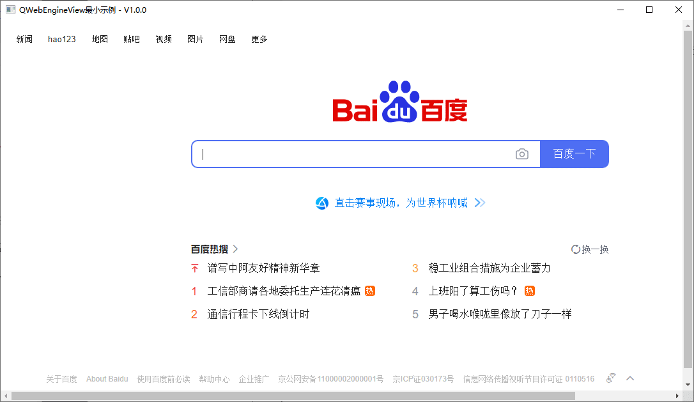
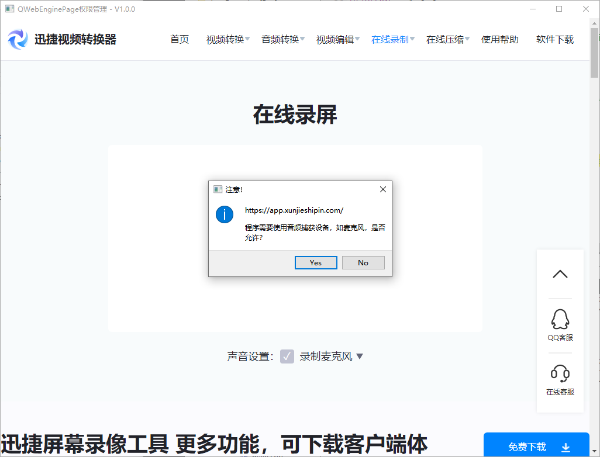

# Qt - Web混合开发Demo

[toc]

---

## 1、说明

|     类名      | 功能                                         |
| :-----------: | -------------------------------------------- |
|    minimal    | 使用QWebEngineView加载显示Web页面的最小示例1 |
|   minimal2    | 使用QWebEngineView加载显示Web页面的最小示例2 |
| authorization | 使用QWebEnginePage打开摄像头演示权限管理     |

 

## 2、相关博客

|                           相关博客                           |
| :----------------------------------------------------------: |
| 👉[CSDN](https://blog.csdn.net/qq_43627907/category_12140943.html)👈 |

## 3、实现效果

### 1.1 minimal

> 1. 保留最简单功能，去掉不易于理解的功能；                 
> 2. 分别演示了加载网络地址、资源文件中的Html文件，本地html的方式； 
> 3. 详细的注释，对初学者更友好。                      

### 1.2 minimal2

> 1. 使用QWebEngineView加载显示Web页面的最小示例2
> 2. 保留最简单功能，去掉不易于理解的功能；                                             
> 3. 分别演示了【QWebEngineView::setHtml】【QWebEngineView::setContent】的使用方法；
> 4. 详细的注释，对初学者更友好。                                                  

* setHtml加载html代码

  

* setHtml加载html代码，并通过相对路径引用参数2的地址中的图片

  

### 1.3 authorization

> 1. 使用QWebEnginePage有时需要权限，例如打开摄像头、麦克风；
> 2. 这里演示了怎么实现授权功能；                     
> 3. 分别展示了打开【网络地址授权】和打开【本地html授权】。          

