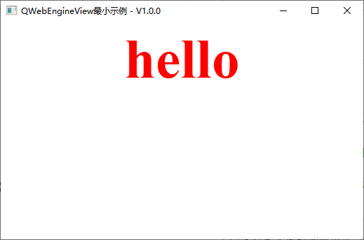
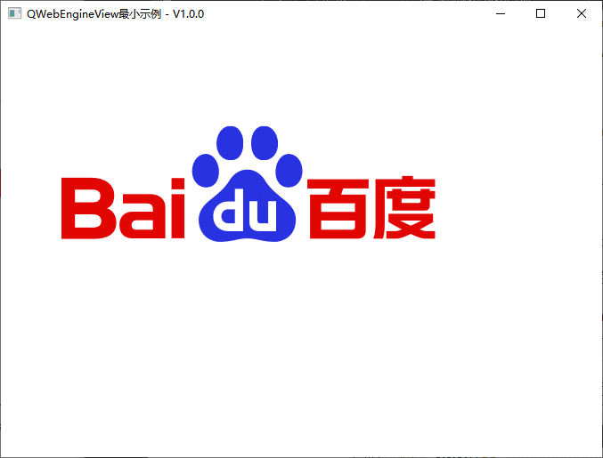
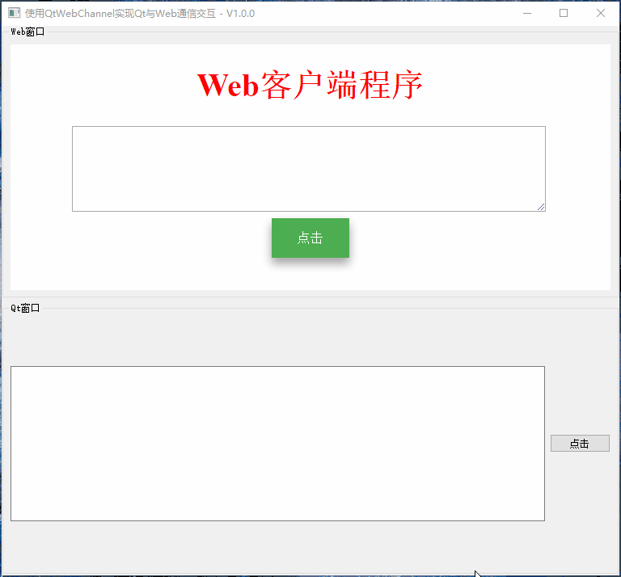
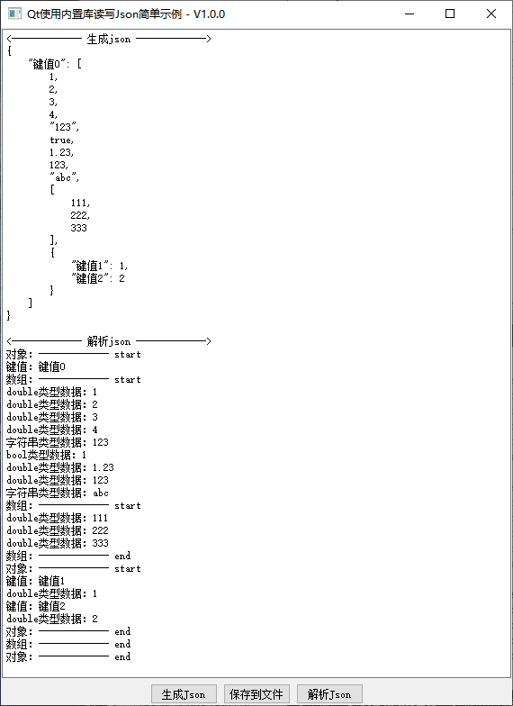
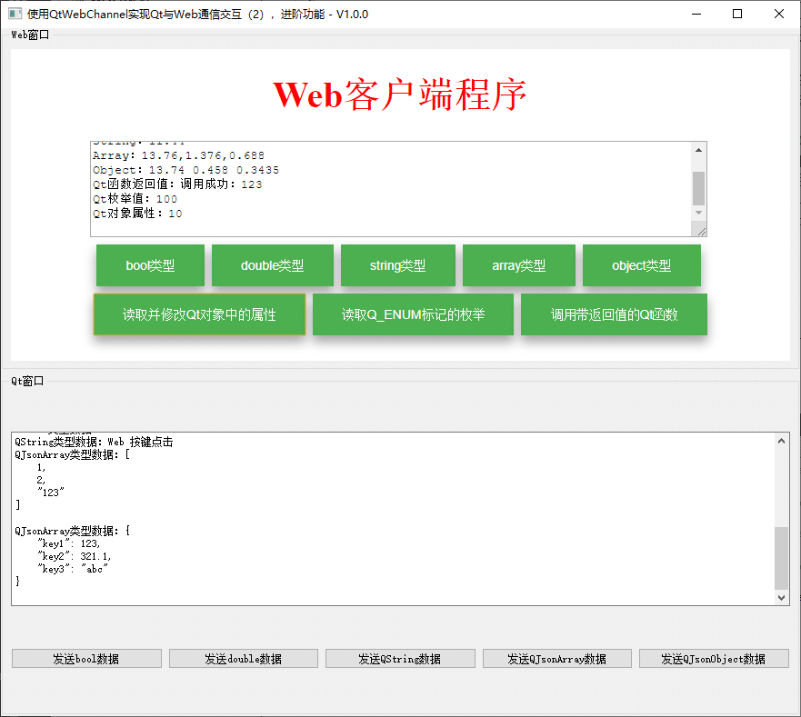
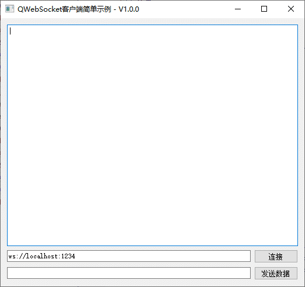
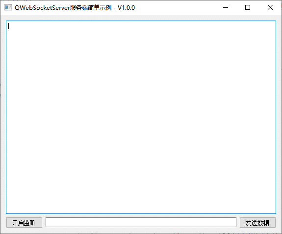

# Qt - Web混合开发Demo

[toc]

---

## 1、说明

|     类名      | 功能                                            |
| :-----------: | ----------------------------------------------- |
|    minimal    | 使用QWebEngineView加载显示Web页面的最小示例1    |
|   minimal2    | 使用QWebEngineView加载显示Web页面的最小示例2    |
| authorization | 使用QWebEnginePage打开摄像头演示权限管理        |
|  channelDemo  | 使用QtWebChannel实现Qt与Web通信交互（简单示例） |
| channelDemo2  | 使用QtWebChannel实现Qt与Web通信交互（进阶功能） |
|    QtJson     | 使用Qt内置json库读写json示例                    |
|  ChatClient   | 使用QWebSocket实现的简单客户端程序              |
|  ChatServer   | 使用QWebSocketServer实现的简单服务端程序        |

 

## 2、相关博客

|                           相关博客                           |
| :----------------------------------------------------------: |
| 👉[CSDN](https://blog.csdn.net/qq_43627907/category_12140943.html)👈 |

## 3、实现效果

### 1.1 minimal

> 1. 保留最简单功能，去掉不易于理解的功能；                 
> 2. 分别演示了加载网络地址、资源文件中的Html文件，本地html的方式； 
> 3. 详细的注释，对初学者更友好。                      

### 1.2 minimal2

> 1. 使用QWebEngineView加载显示Web页面的最小示例2
> 2. 保留最简单功能，去掉不易于理解的功能；                                             
> 3. 分别演示了【QWebEngineView::setHtml】【QWebEngineView::setContent】的使用方法；
> 4. 详细的注释，对初学者更友好。                                                  

* setHtml加载html代码

  

* setHtml加载html代码，并通过相对路径引用参数2的地址中的图片

  

### 1.3 authorization

> 1. 使用QWebEnginePage有时需要权限，例如打开摄像头、麦克风；
> 2. 这里演示了怎么实现授权功能；                     
> 3. 分别展示了打开【网络地址授权】和打开【本地html授权】。          

### 1.4 channelDemo

> 1. 使用QtWebChannel实现Qt与Web双向交互；       
> 2. 构建后将html、css、js文件自动拷贝到可执行程序路径下；
> 3. web界面和qt界面实现双向通信。             

### 1.5 QtJso

> 1. 使用Qt内置json库读写json示例                             
> 2. 实现生成json数据，插入json数组、json对象以及各种json支持的数据类型；
> 3. 将json数据保存到json文件中；                        
> 4. 从json文件中读取json数据，并使用【递归】的方式解析json数据。      

### 1.6 channelDemo2

用QtWebChannel实现Qt与Web双向交互（2），进阶功能 ；

> 1. 
>    构建后将html、css、js文件自动拷贝到可执行程序路径下；                 
> 2. web界面和qt界面实现双向通信；                               
> 3. 由于QWebChannel传递数据只有可以转换为【JSON的数据类型】才可以传递，其它类型无法传递，例如QByteArray这些JSON不支持的数据类型，这里演示了可以传递的所有数据类型的使用方式；                         
> 4. Web界面中javascript直接读取Qt中注册对象使用Q_PROPERTY定义的【属性值】；
> 5. Web界面中javascript直接读取Qt中注册对象使用使用Q_ENUM标记的【枚举】；   
> 6. 定义一个带有返回值的槽函数，javascript调用该函数后可以获取【返回值】；        

### 1.7 ChatClient

QWebSocket客户端简单示例   

> 1. 
>    实现连接、断开连接、数据发送、数据接收显示功能；

### 1.8 ChatServer

QWebSocketServer服务端简单示例

> 1. 使用QWebSocketServer创建一个服务端，使用【非安全模式】;  
> 2. 将所有连接的客户端加入列表，实现服务端同时向所有客户端发送信息；      
> 3. 实现将客户端传递过来的信息转发给其它所有客户端；              
> 4. 实现在关闭时释放所有客户端功能。                      

