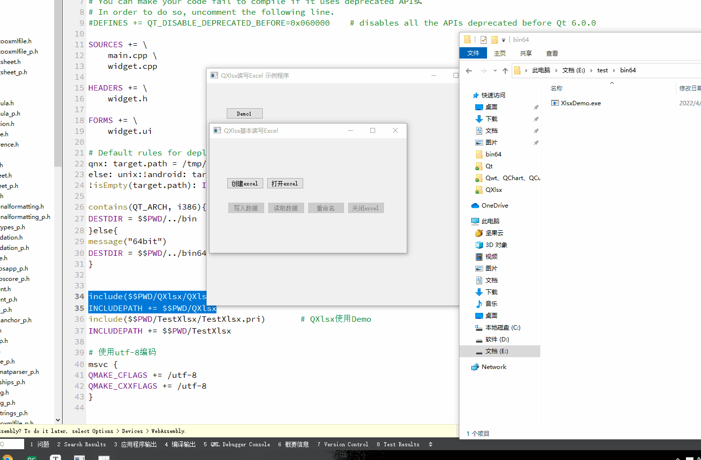

# Qt使用QXlsx库操作Excel Demo说明及演示

[toc]

## 1、说明

| 类名  | 功能                                                         |
| ----- | ------------------------------------------------------------ |
| Test1 | QXlsx基本功能使用，创建Excel、打开Excel、写入数据、读取数据、Excel另存为、关闭Excel |
| Test2 | QXlsx操作工作表（Sheet）Demo，包括新建、插入、查询、移动、重命名、复制、删除等。 |
| Test3 | 查询设置工作表（Sheet）可见/隐藏状态                         |
|       |                                                              |

## 2、实现效果

### 1.1 Test1

> 1. 创建一个新的Excel，并具有一个默认的Sheet；
> 2. 打开Excel文件，并判断是否打开成功；
> 3. 分别使用单元格引用和行列号两种方式将数据写入Excel；
> 4. 分别使用单元格引用和行列行两种方式读取Excel所有数据；
> 5. 将Excel数据另存为2.xlsx；
> 6. 释放Excel数据。

### 1.2 Test2

> 1. 查询打开的Excel中所有可用的工作表（Sheet）名称；
> 2. 创建指定名称的工作表（Sheet），自动添加到最末尾，支持ST_WorkSheet、ST_ChartSheet两种类型；
> 3. 在指定位置插入一个新的指定名称的工作表（Sheet），支持ST_WorkSheet、ST_ChartSheet两种类型；
> 4. 将某个工作表（Sheet）设置为当前活动工作表，并写入数据（ST_WorkSheet类型）；
> 5. 将指定名称的工作表（Sheet）重命名为一个新的名称，不改变其它因素；
> 6. 将指定名称的工作表（Sheet）拷贝为一个新的指定名称的工作表，两个工作表内容相同；
> 7. 将指定名称的工作表（Sheet）移动到指定位置；
> 8. 删除指定名称的工作表（Sheet）。
> 

### 1.3 Test3

> 1. 创建指定名称的工作表（Sheet），自动添加到最末尾；
> 2. 查询打开的Excel中所有可用的工作表（Sheet）名称；
> 3. 查询选中工作表的状态（显示、隐藏、绝对隐藏）；
> 4. 设置选中工作表的状态（显示、隐藏、绝对隐藏）；
> 5. 一键调用WPS快速打开Excel（为了方便查看效果）。

